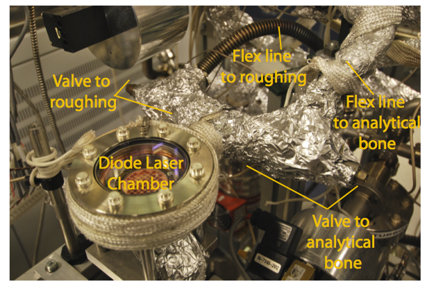
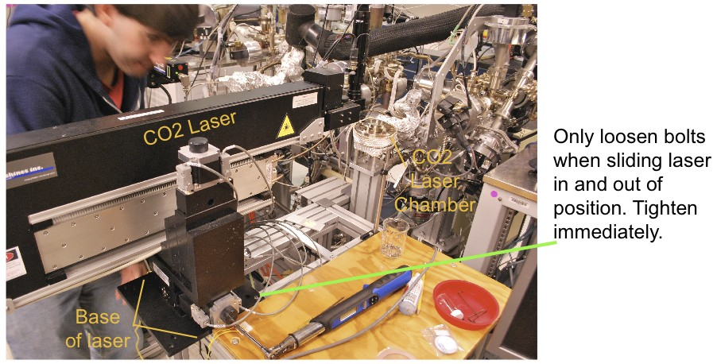
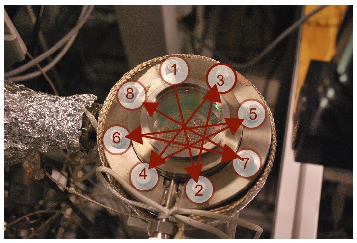

=======================
Loading |CO2| Samples
=======================

.. |CO2| replace:: CO\ :sub:`2`

Please read this guide carefully and follow the provided checklist

CO2 Laser Loading Instructions for the Argus VI
------------------------------------------------
This section describes the procedure for loading a |CO2| laser tray on the new NMGRL extraction line.

You will need: torque-wrench, flat-head screw driver, vice grip pliers, 4mm hex wrench, tweezers, new KBr cover slip, new 4.5 in. copper gasket

#.  Confirm that multiple-runs has finished.
#.  Take note of the pressure in the roughing, minibone, and microbone system. Roughing and analytical pressures should be approximately 10\ :sup:`-7`\  to 10\ :sup:`-8`\  and 10\ :sup:`-9`\  to 10\ :sup:`-10`\  torr, respectively.
#.  Configure values for breaking vacuum. Close and lock pneumatic valves G (CO2 laser to roughing), A (CO2 laser to microbone), and F (CO2 laser to bone). If necessary, close the manual valve between the diode laser chamber and the roughing line (:num:`Fig. #figureco21`). CO2 chamber is now isolated from UHV and roughing systems. 
#.  Place protective metal plate on |CO2| laser chamber window.
#.  Slightly loosen the two bolts that connect the |CO2| laser base to the |CO2| laser stand. Bolts should remain engaged in their nuts. Slide the |CO2| laser back on the rail until you can freely access |CO2| laser chamber. The base of the laser will hang off of the laser rack. Retighten the bolts (:num:`Fig. #figureco22`).
#.  Loosen the heating tape on the |CO2| laser chamber so that the heating tape dangles beneath the |CO2| laser chamber.
#.  Unbolt the |CO2| laser chamber window.. Roughing, minibone, and microbone pressure should not change. Set the |CO2| laser chamber window on a fresh piece of Al-foil on the |CO2| laser cart. Remove the copper gasket using a vice grip wrench. Place a fresh copper gasket on the knife-edge seal of the |CO2| laser chamber. Never leave the knife edge exposed for long periods. The three, free-floating posts on the inside of the laser chamber are used to stabilize the KBr cover slip. These can be kept in their position or set aside for easy access. Dispose of the KBr cover slip in the radiation waste bin in the radiation room. Remove the "used" laser tray using tweezers and place it back in the radiation room. 
#.  Using tweezers, carefully place the "new" laser tray in the |CO2| laser chamber so that the notch at the top of the tray is closest to the extraction line (:num:`Fig. #figureco23`). Using tweezers, place a new KBr cover slip on the copper tray. 
#.  Place the |CO2| laser chamber window on top of the |CO2| laser chamber base. Tighten the |CO2| laser chamber bolts using the torque wrench and a "wagon wheel" pattern (:num:`Fig. #figureco24`). Tighten the |CO2| laser chamber in four increments (40, 70, 100, and 120 in/lbs). |CO2| laser chamber is now ready to be evacuated.
#.  Turn off roughing ion gauge (lower switch on gauge display) and roughing turbo pump (far right button on "shared roughing" pump controller.)
#.  Unlock and open pneumatic valve G (|CO2| laser to roughing). Atmospheric gas is now in the roughing section of the extraction line. Backing pressures of the roughing section (bottom two displays on the roughing gauge) will briefly increase (~3-4 torr) and then decrease to approximately 10-1 torr.
#.  Turn on the roughing turbo pump. Initial current will be between 2 and 3 amps. Within a couple of minutes the turbo current should decrease to ~0.2 amps when back to full speed or 1500 hz. Turn on roughing ion gauge. Pressure should be between 10-5 and 10-6 torr and decreasing. Lock pneumatic valve G in the open position. If the turbo pump is pulling too much current and/or the pressure is significantly higher than expected values, this may indicate a leak in the |CO2| laser chamber. Close and lock valve G (|CO2| laser to roughing) and repeat steps 6 through 11.
#.  Rewrap the sides of the |CO2| laser chamber with the heating tape (:num:`Fig. #figureco22`). Fasten thermocouple ring to laser chamber and insert thermocouple. Make sure the thermocouple and heating tapes are plugged in. If necessary, place heating tape over the cold-finger. Wrap the |CO2| laser chamber and cold finger with aluminum-foil.
#.  Open Bakedpy on the pyValve/pyCO2 computer. Using the drop-down menu in the control panel, select "CO2-8hour.cfg", then hit execute. Bakeout controllers 2,3, and 4 should begin heating and temperatures will slowly increase on the time vs. temperature plot at the bottom of the Bakedpy window. (NOTE: Sometime heating tapes are switched for various reasons; controllers 2,3, and 4 will not always be used).
#.  Put tools away and clean up the workspace!

.. _figureco21:

   
   Picture of diode laser chamber showing location of valves. For baking the |CO2| chamber, close the valve between the laser chamber and roughing system.

.. _figureco22:

   Picture showing the configuration of |CO2| system for loading laser trays and baking. Base of the laser will hang off the laser cart. |CO2| laser has heating tapes in correct orientation for baking.

.. _figureco23:

.. figure:: images/CO2_Figure3.png
   :scale: 100% 
   
   Proper orientation of laser tray in CO2 laser chamber.

.. _figureco24:

   
   Bolting pattern for CO2 laser chamber.