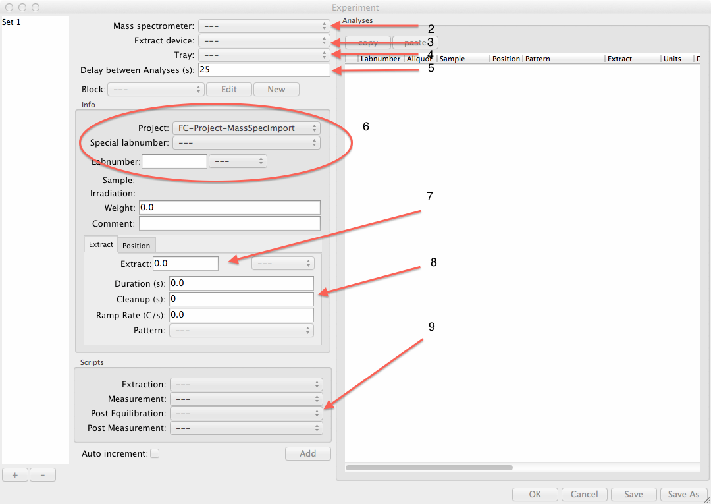

Experiments
======================

This section describes how to set up a series of automated analyses. 
In pychron nomenclature this grouping is refered to as an "experiment set".

Make a New Experiment
-----------------------

#. Open a new Experiment Editor. ``Experiment>>Sets>>New``
#. Select a mass spectrometer
#. Select an extraction device
#. **[Optional]** Select a sample tray
#. Set ``Delay Between Analyses`` in seconds
#. Enter a Labnumber.
    #. Enter number by hand. 
    #. Select Project, then select from a list of associated labnumbers
    #. Select a special labnumber, e.g. blank, background, etc...
    
#. For unknowns set the extraction value and units
#. For unknowns and blanks set the extraction duration and cleanup time in seconds
#. Modify the scripts. Defaults scripts are determined based on the extraction device and labnumber. Defaults are defined at ``~/Pychrondata_<version>/scripts/defaults.yaml``
#. Hit Add

   
