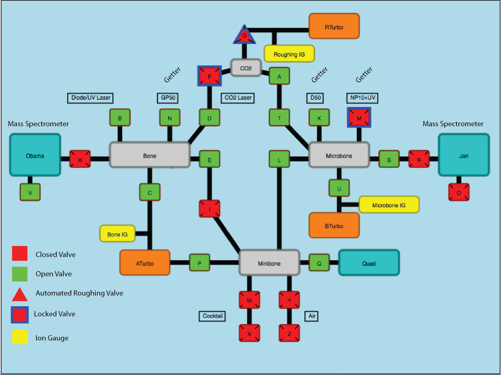

======================
Extraction Line
======================

   

Bone Valves
---------------------
===== ============================================
Name  Description
===== ============================================
B     Bone to Diode Laser
C     Bone to Turbo
D     Bone to CO2 Laser
E     Bone to Minibone
H     Obama Inlet
N     Bone to Getter GP-50
===== ============================================

Minibone Valves
---------------------
===== ============================================
Name  Description
===== ============================================
I     Minibone to Bone
Q     Quad Inlet
P     Minibone to Turbo
W     Outer Pipette 1
X     Inner Pipette 1
Y     Outer Pipette 2
Z     Inner Pipette 2
===== ============================================

Microbone Valves
---------------------
===== ============================================
Name  Description
===== ============================================
K     Microbone to Getter D-50
L     Microbone to Minibone
M     Microbone to Getter NP-10
R     Jan Inlet
S     Microbone to Inlet Pipette
T     Micorbone to Laser
U     Microbone to Turbo
===== ============================================

CO2 Valves
---------------------
===== ============================================
Name  Description
===== ============================================
A     CO2 Laser to Jan
F     CO2 Laser to Obama
G     CO2 Laser to Roughing
===== ============================================

Spectrometer Ion Pump Valves
-----------------------------
===== ============================================
Name  Description
===== ============================================
V     Obama Ion Pump	
O     Jan Ion Pump
===== ============================================

